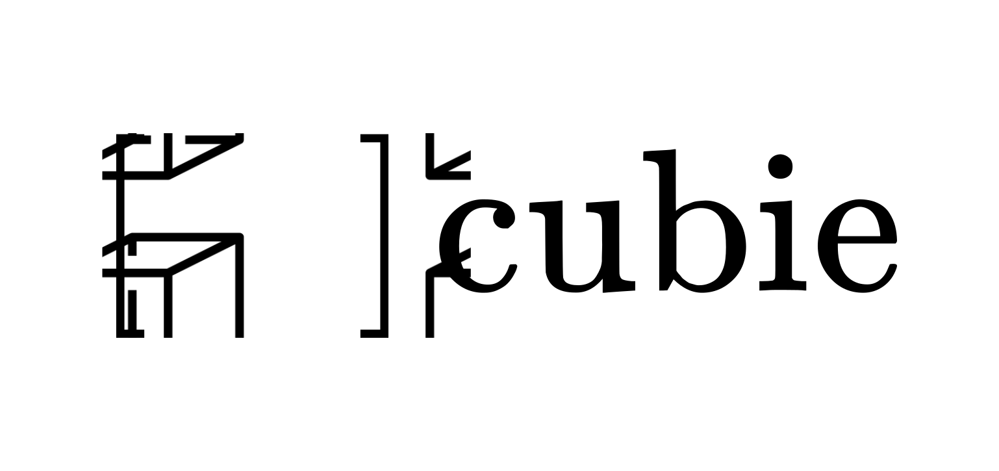

<picture>

  <source media="(prefers-color-scheme: dark)" srcset="./assets/banner@dark.svg">
  <source media="(prefers-color-scheme: light)" srcset="./assets/banner@light.svg">
  
</picture>

<p align="center">
A tiny Rubik's cube simulator, powered by linear algebra.
</p>

> Due to the heavily mathematical nature of this simulator, the notation may be slightly different than the Rubik's cube notation you may expect. Check out [cubekit](https://github.com/EvanZhouDev/cubekit) for a more user-friendly Rubik's cube library.

## Usage

All cube logic is stored in the `Cube` object.

To get started, create a new instance:

```javascript
let myCube = new Cube();
```

### Rotating a Layer

Next, nearly all turns can be defined with the following functions: `rx()`, `ry()`, and `rz()`. You will have to pass the result of this function into `Cube.turn()`.

These functions all take 3 parameters: `rotations`, `layerStart`, and `layerEnd`. Depending on the axis you want to turn, choose one of the three functions.

Then, determine how many 90° rotations you want to do, putting it into the first parameter.
Next, select an interval of layers to turn. On each axis, the layers are -1, 0, and 1. For example, turning the +x layer by 90° will use a rotation function like this: `rx(1, 1)`. Notice how the `layerEnd` parameter can be skipped if the start and end are the same.

Now, to actually mutate the `Cube`, do the following:

```javascript
myCube.turn(rx(1, 1));
```

### Seeing the Result

In order to see that you have actually successfully turned a layer, you will need to use the `Cube.flatten()` method. This will return an object with keys in this format: `x,y,z`, where these values designate the side of the cube we are viewing.

For example, `1,0,0` represents the +x side, `0,-1,0` the -y side, and so on. Each of these is assigned a Color number, in which the color for -x is 0, +x is 1, -y is 2, +y is 3, -z is 4, and finally, +z is 5.

## How it Works

A typical way to simulate a Rubik's cube is by storing each face of the Rubik's cube, and modifying each "sticker" on that face individually during a turn. However, I went with an approach that better mimics how a Rubik's cube works in real life—storing each piece individually, and simulating turns with [3D rotation matricies](https://en.wikipedia.org/wiki/Rotation_matrix#In_three_dimensions).

I will begin by explaining the mathematical properties of the Rubik's cube, then transitioning into how I have implemented them in code.

### A Piece

A piece is made up of two vectors, the Position Vector ($\vec{p}$) and the Color Vector ($\vec{c}$).

The position vector denotes the location of the piece on the cube. The "core" of the 3x3 Rubik's cube is at $(0,0,0)$, and the each piece looks something like this.

```math
\mathbf{p} = \begin{bmatrix}
x\\
y\\
z
\end{bmatrix}, \quad \text{where } x, y, z \in \{-1, 0, 1\}
```

Next, I assigned each of the 6 colors on the Rubik's cube a number from $0$ to $5$.

```math
\mathbf{c} = \begin{bmatrix}
c_x\\
c_y\\
c_z
\end{bmatrix}, \quad \text{where } c_x, c_y, c_z \in \{0, 1, 2, 3, 4, 5\}
```

The color associated on the $x$, $y$, and $z$ dimensions are the colors of the "stickers" on that side. Notice how each piece on the cube has at most 3 colors, so we do not have to specify 6 different colors for one piece.

It is important to note that the color on the $x$ face can be interpreted to be on both the $+x$ face and the $-x$ face, and similarly for $y$ and $z$.

#### Impact of Rotation on a Piece

Rotating a piece involves two significant parts. Transforming the Position Vector, and then the Color Vector.

The use of the 3D elemental rotation matrix to move the piece may be misleading in this case—instead, see the "rotation" as moving the piece's Position Vector, without actually rotating it. Then, we have to actually rotate the colors on it by changing the Color Vector.

##### Position:

Here are the 3 elemental rotation matricies, which is what we are using to rotate a piece by a certain amount.

```math
R_x(\theta) = \begin{bmatrix}
1 & 0 & 0\\
0 & \cos(\theta) & -\sin(\theta)\\
0 & \sin(\theta) & \cos(\theta)
\end{bmatrix}
```

```math
R_y(\theta) = \begin{bmatrix}
\cos(\theta) & 0 & \sin(\theta)\\
0 & 1 & 0\\
-\sin(\theta) & 0 & \cos(\theta)
\end{bmatrix}
```

```math
R_z(\theta) = \begin{bmatrix}
\cos(\theta) & -\sin(\theta) & 0\\
\sin(\theta) & \cos(\theta) & 0\\
0 & 0 & 1
\end{bmatrix}
```

In order to rotate our piece, we simply multiply the rotation matrix, in this example on the x-axis, to our position vector.

```math
R_x(\theta)\cdot\vec{p} = \begin{bmatrix}
1 & 0 & 0\\
0 & \cos(\theta) & -\sin(\theta)\\
0 & \sin(\theta) & \cos(\theta)
\end{bmatrix}\cdot\begin{bmatrix}
x \\
y \\
z
\end{bmatrix}
```

##### Color:

Handling the colors are a bit more complicated. Let's consider what happens to the colors on a corner piece when it is rotated. I will be refering to this changing arrangement of colors as Sticker Parity.

If a corner piece is rotated in the x-axis, notice how the sticker that was originally facing the x-axis is still facing the x-axis. However, the color that was originally facing the y-axis is now facing the z-axis. Similarly, the sticker originally facing the z-axis is now facing the y-axis.

Considering this for rotations on y and z axes, you will notice that it is always true that the sticker facing the axis you are rotating stays in that direction, while the stickers facing the other two axes will swap directions.

Note that the stickers may move from the positive side of an axis to the negative side of another axis. This is why it is important that our Color Vector contains 3 colors for each axes that is transient over both the positive and negative sides of an axes.

In order to mathematically represent this, I have created some simple transformation matrices that simply swap 2 components of a Vector. Let's call these $T$, for a general transformation.

One further note before seeing the formulas below is that if we turn the side $90\degree\cdot(2n+1) \text{ for }n\in\mathbb{N}$ the Sticker Parity rule applies. However, for any multiple of $180\degree$, the same Sticker Parity before and after _will be the same_. Thus, we will need to keep track of how many $90\degree$ rotations we are applying (Referred to hereinafter as $\alpha$, not to be confused with $\theta$), and use modulo to detect if there is Sticker Parity.

```math
T_x(\alpha) = \begin{bmatrix}
1 & 0 & 0\\
0 & 1 - \alpha\bmod2 & \alpha\bmod2\\
0 & \alpha\bmod2 & 1 - \alpha\bmod2
\end{bmatrix}
```

```math
T_y(\alpha) = \begin{bmatrix}
1 - \alpha\bmod2 & 0 & \alpha\bmod2\\
0 & 1 & 0\\
\alpha\bmod2 & 0 & 1 - \alpha\bmod2
\end{bmatrix}
```

```math
T_z(\alpha) = \begin{bmatrix}
1 - \alpha\bmod2 & \alpha\bmod2 & 0 \\
\alpha\bmod2 & 1 - \alpha\bmod2 & 0 \\
0 & 0 & 1
\end{bmatrix}
```

Similarly to the position matricies above, we simply multiply it onto our color matrix.

```math
T_x(\alpha)\cdot\vec{c} = \begin{bmatrix}
1 & 0 & 0\\
0 & 1 - \alpha\bmod2 & \alpha\bmod2\\
0 & \alpha\bmod2 & 1 - \alpha\bmod2
\end{bmatrix}\cdot\begin{bmatrix}
x \\
y \\
z
\end{bmatrix}
```

However, there's one more tricky thing that you may notice (I sure didn't on the first time I implemented it!). Let's first rewrite these modulos in terms of $\sin$ and $\cos$. I'll show the one for $T_x$ for demo:

```math
T_x(\alpha) = \begin{bmatrix}
1 & 0 & 0\\
0 & |\cos(\alpha)| & |\sin(\alpha)|\\
0 & |\sin(\alpha)| & |\cos(\alpha)|
\end{bmatrix}
```

Notice how this is extremely similar to our rotation matricies. In fact, other than the absolute values, they are _exactly the same_!

So, instead of using two different transformation matrices, we will only be using one—our rotation matricies we defined above. Then, when presenting the values to the user, we will just need to ensure that the values are positive.

Now, let's look at how I have organized this data structure in code.

### The Cube

Let's get the logistics out of the way first.

All "angles" from this point on will be referring to a multiple of $\frac{\pi}{2}$. I have defined `sin` and `cos`'s inputs to be multiplied by $\frac{\pi}{2}$, then have the output rounded to an integer (as rounding errors occur if they don't).

Then, all matricies are flattened into an array to not make it too ugly. This means your rotation matrix will look like this:

```javascript
[1, 0, 0, 0, cos(T), -sin(T), 0, sin(T), cos(T)];
```

And your position matrix will look like this: `[1,1,1]`.

A custom matrix-multiplication method is written to matrix-multiply these arrays.

All cube logic is contained in a class called `Cube`, and each Piece is an array (no point to make it an object) that looks like this:

```javascript
[
	[px, py, pz],
	[cx, cy, cz],
];
```

And these Pieces are contained in a list in the `Cube` class.

Now, for the fun part...

#### Defining a Overarching Rotation Function

To make this clean and simple, I wanted a 3 rotation functions, one for each axis, that looked something like this:

| Input A                       | Input B          | Output                 |
| ----------------------------- | ---------------- | ---------------------- |
| Angle to Rotate (in $\alpha$) | Layers to Rotate | A Single Array of Data |

The reason I wanted this is so that I could rotate a layer by calling the `turn` method on `Cube` with one argument, that would dictate an entire turn.

For example, rotating the +x layer by 90° could look like this:

```js
let myCube = new Cube();
myCube.turn(rx(1, 1));
```

This is much cleaner and mathematically efficient than having a different turn function for "R", "U", "L", etc.

It took a lot of iteration, but I eventually ended up with the following format for a rotation function:

```javascript
let rx = (alpha, x1 = 1, x2 = x1) => [
	1,
	0,
	0,
	0,
	cos(alpha),
	-sin(alpha),
	0,
	sin(alpha),
	cos(alpha),
	0,
	x1,
	x2,
];
```

Note the format of this. The first 9 elements of the array is my 3x3 rotation matrix. The last 3 elements of the array are the metadata, which tells the `Cube.turn` method which axis it is turning on, and which layers to turn.

Remember that "custom matrix-multiplication method" mentioned above? Well, it only uses the first 9 elements of the array, so the remaining elements can be read harmlessly.

#### Putting it All Into a Cube

Now, to make the cube class, we first initiate a total of 26 pieces ($3^3-1$) with correct positions and colors.

In order to generate the colors, we take the position of the piece, and transform each component a little bit to turn each component into a unique color. As `x`, `y`, and `z` are either -1 or 1 (or 0, but we do not need to worry about those colors), we do `(component + 1) / 2` to compress it into a 0 or a 1. Then, offset each axis by 2. The code looks something like this:

```js
[x, y, z].map((x, i) => (x + 1) / 2 + i * 2);
```

As mentioned before, the colors are numbers, and they are completely abstract—up for the user to assign actual meaning to. However, this is the pattern: -x is 0, +x is 1, -y is 2, +y is 3, -z is 4, and finally, +z is 5.

##### Doing a Turn:

Now, to `turn` the cube, we have to use the `metadata` line of the rotation function we defined above:

```
[axis, start, end]
```

Iterate over all the pieces, finding all pieces whose component for the given axis (a number from 0 to 2, where 0 is x, 1 is y, and 2 is z) is between start and end, and apply the rotation matrix to both the color and position vectors (again, remember that applying the rotation matrix to the color vector will result in negatives, but that will be fixed in the flatten method, described below).

The entire code looks like this (where `R` is our rotation matrix w/ metadata):

```js
const [axis, start, end] = R.slice(9);

for (let i in this.pieces) {
	const piece = this.pieces[i],
		pos = piece[0][axis];
	if (pos >= start && pos <= end) {
		this.pieces[i] = piece.map((x) => mult(R, x));
	}
}
```

#### Flattening the Cube

The final step is to turn the collection of pieces into a (somewhat) human-readable object.

The direction of the flattening is shown in the diagram below, with the arrow pointing on the "up" direction on each face.

```
    +---+
    |^+y|
+---+---+---+---+
|^-x|^+z|^+x|^-z|
+---+---+---+---+
    |^-y|
    +---+
```

Each face is identified with one of these strings: `["1,0,0", "-1,0,0", "0,1,0", "0,-1,0", "0,0,1", "0,0,-1"]`

These strings are coordinate pairs identifying the face axis and whether its positive or negative.

For example, `"1,0,0"` represents the +x face, `"0,-1,0"` represents the -y face, and so on.

Flattening the cube is done through some projection mathematics. Essentially, for every face, two numbers are calculated for the corresponding `i` and `j` coordinates for that face.

Let's take an example of the x face. Through some simple visualization, we are able to see that in order to project a piece's x-face color onto the -x plane, the coordinate on the **-x plane** is $(2 - (y+1), z + 1)$. To project the piece's x-face color onto the +x plane, the coordinate on the **+x plane** is $(2 - (y+1), 2 - (z+1))$. Let us simplify these two with absolute values.

-x: $(|y-1|, |z+1|)$

+x: $(|y-1|, |z-1|)$

For sake of symmetry, I've added an absolute value to the `-x` plane calculation as well. Now, we can generalize everything in terms of x:

$(|y-1|, |z-\text{sign}(x)|)$

Now, just do this for all 3 axes, and it looks something like this:

| x                                        | y                                        | z   |
| ---------------------------------------- | ---------------------------------------- | --- |
| $(\|y-1\|, \|z-\text{sign}(x)\|)$ | $(\|z+\text{sign}(y))\|, \|x+1\|)$ |  $(\|y-\text{sign}(z))\|, \|x+\text{sign}(z))\|)$  |

Now, just remember that we will need to assign the **absolute value** of the color vector to the plane.

Finally, putting it all together, let's implement it in code.

One thing that we have to note is that some pieces are not projected onto any plane. Upon visual inspection, pieces that are not projected onto face $n$ have a 0 in component $n$. Now, the trick is to create a result object with a key `"0,0,0"`, that will get assigned randomly all of these non-existent (one may say "imaginary") stickers. Then, we delete this at the end.

The final function looks like this:

```js
flatten() {
        const flattened = ["1,0,0", "-1,0,0", "0,1,0", "0,-1,0", "0,0,1", "0,0,-1", "0,0,0"]
            .reduce((acc, piece) => ({ ...acc, [piece]: Array(3).fill().map(_ => Array(3)) }), {});

        for (const [p, [cx, cy, cz]] of this.pieces) {
            const [x, y, z] = p;
            flattened[String([x, 0, 0])][abs(y - 1)][abs(z - sign(x))] = abs(cx);
            flattened[String([0, y, 0])][abs(z + sign(y))][abs(x + 1)] = abs(cy);
            flattened[String([0, 0, z])][abs(y - sign(z))][abs(x + sign(z))] = abs(cz);
        }

        delete flattened[String([0, 0, 0])]
        return flattened;
    }
```

And that's all!
